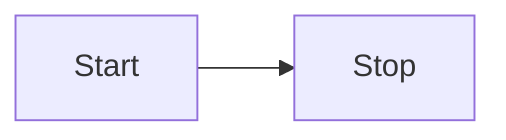

# remark-code-example

Remark plugin to copy live code block as code example.

[![npm][npm-badge]][npm-url]
[![github][github-badge]][github-url]
![node][node-badge]

[npm-url]: https://www.npmjs.com/package/remark-code-example
[npm-badge]: https://img.shields.io/npm/v/remark-code-example.svg?style=flat-square&logo=npm
[github-url]: https://github.com/nice-move/remark-code-example
[github-badge]: https://img.shields.io/npm/l/remark-code-example.svg?style=flat-square&colorB=blue&logo=github
[node-badge]: https://img.shields.io/node/v/remark-code-example.svg?style=flat-square&colorB=green&logo=node.js

## Installation

```sh
npm install remark remark-code-example --save-dev
```

## Usage

```mjs
import readFileSync from 'fs';

import { remark } from 'remark';
import { remarkCodeExample } from 'remark-code-example';

const markdownText = readFileSync('example.md', 'utf8');

remark()
  .use(remarkCodeSample, {})
  .process(markdownText)
  .then((file) => console.info(file))
  .catch((error) => console.warn(error));
```

### Options.metas

- type: object of string
- default: {}
- required: false
- description: Metas of example code block

## Syntax

### code-example

`````markdown
Turn



Into

````markdown

````
`````

### code-example-copy

`````markdown
Turn


Into

````markdown

````


`````

### code-alias-copy

````markdown
Turn


Into

```diagram
flowchart LR
  Start --> Stop
```


````
